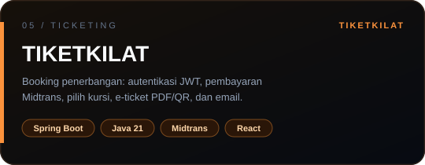
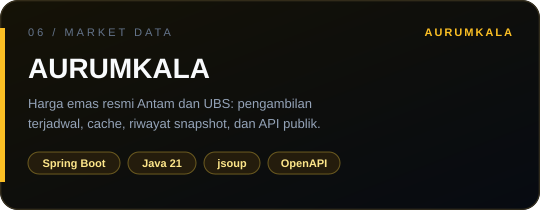
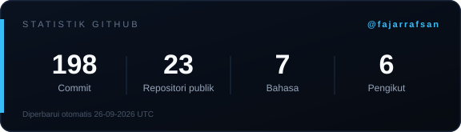

  

 

  

  
  
  

  
  
  

## Tentang saya

Saya **Fajar Rafsan**, fullstack developer di Bandung. Saya merancang sistem ujung ke ujung: API Java/Spring yang andal di belakang, interface React 19 / TypeScript yang jelas di depan.

Latar **akuntansi** (S1, IPK 3.71) membentuk cara saya merancang data — transaksi harus seimbang, migrasi harus terkunci, otorisasi tidak boleh bocor ke klien. Latar **engineering** memberi sistemnya: service layer, event, cache, dan kontrak REST yang bisa diikuti UI.

Saat ini saya mengajar **Java Fundamentals** di Universitas Nasional Pasim, dan terbuka untuk kesempatan fullstack.

### Cara saya membangun

| Batas | Prinsip |
| --- | --- |
| **Auth** | Keputusan otorisasi tetap di gateway dan service. Front end hanya membawa identitas. |
| **Kontrak** | Tipe di klien mengikuti REST, bukan sebaliknya — UI tidak menebak bentuk data. |
| **Event** | Setiap request punya jalur. Setiap event (RabbitMQ / WebSocket) punya tujuan. |
| **Data** | PostgreSQL + migrasi Flyway. Cache Redis untuk yang sering dibaca, bukan untuk yang harus benar. |

## Sistem yang saya bangun

Enam sistem nyata — streaming, reservasi hotel, e-commerce emas, akuntansi, tiket penerbangan, dan data harga pasar — bukan daftar tutorial.

<table width="100%">
  <tr>
    <td width="50%" valign="top">
      
      

        
        
      

      Dual-source: katalog/episode dari Samehadaku, metadata dari AniList GraphQL. Auth email + Google OAuth, Redis single-flight cache, Prisma, PostgreSQL.
    </td>
    <td width="50%" valign="top">
      
      

        
        
      

      Microservices event-driven: Eureka, API Gateway, RabbitMQ, JWT, pembayaran Midtrans, invoice PDF. Dashboard React 19 + TypeScript, analitik live, dwibahasa ID/EN.
    </td>
  </tr>
  <tr>
    <td width="50%" valign="top">
      
      

        
        
      

      E-commerce perhiasan emas: Xendit, RajaOngkir, chat WebSocket/STOMP, poin loyalitas, retur, dan pembukuan double-entry yang menjurnal setiap transaksi. Flyway mengunci skema.
    </td>
    <td width="50%" valign="top">
      
      

        
      

      Sistem informasi akuntansi: chart of accounts, jurnal umum & posting, buku besar, neraca saldo, laba rugi, neraca, perubahan modal, periode, dan faktur penjualan.
    </td>
  </tr>
  <tr>
    <td width="50%" valign="top">
      
      

        
        
      

      Booking penerbangan ujung ke ujung: autentikasi JWT, pembayaran Midtrans, pemilihan kursi, e-ticket PDF dengan QR, notifikasi email, dan operasi admin. Spring Boot 3 + Java 21, antarmuka React + TypeScript.
    </td>
    <td width="50%" valign="top">
      
      

        
      

      Monitor harga emas resmi Antam dan UBS. Pengambilan terjadwal Senin–Sabtu, cache agar situs sumber tidak dipanggil berlebihan, riwayat snapshot di basis data, API publik berdokumentasi OpenAPI, dan dashboard admin untuk sinkronisasi manual serta ekspor CSV.
    </td>
  </tr>
</table>

<strong>Proyek lain</strong>

- [ARUNIKA](https://github.com/fajarrafsan/ARUNIKA) — landing page brand kopi specialty. HTML, CSS, dan JavaScript murni tanpa framework, responsif sampai 320px.
- [Shopify-Console-C](https://github.com/fajarrafsan/Shopify-Console-C) — aplikasi toko berbasis konsol yang ditulis dari nol dengan C. TUI digambar manual: bingkai CP437, warna ANSI, kursor Win32, tanpa pustaka UI.
- [Belajar-Java](https://github.com/fajarrafsan/Belajar-Java) — materi dan latihan Java yang saya pakai saat mengajar.
- [fajar-creative-portfolio](https://github.com/fajarrafsan/fajar-creative-portfolio) — situs portofolio (Cloudflare Workers).

## Stack

Alat yang benar-benar dipakai di sistem di atas — bukan daftar semua yang pernah disentuh.

**Backend & data**

  

**Frontend**

  

**Runtime & tools**

  

| Lapisan | Yang saya kerjakan |
| --- | --- |
| **Java & Spring Boot** | REST, Spring Security, JWT / OAuth2, service layer, Flyway |
| **Microservices** | Eureka, API Gateway, RabbitMQ, Docker Compose |
| **Data** | PostgreSQL, Redis, transaksi, konsistensi, caching yang disengaja |
| **Interface** | React 19, TypeScript, Tailwind v4, Vite, WebSocket/STOMP |
| **Pembayaran** | Xendit (GlowMarket), Midtrans (Roomly, TiketKilat) |
| **Data eksternal** | Scraping terjadwal dengan jsoup, cache berbatas waktu, dan snapshot yang bisa ditelusuri (AURUMKALA) |

## Pengalaman & pendidikan

| Periode | Peran | Tempat |
| --- | --- | --- |
| Jan 2026 — sekarang | **Java Fundamentals Instructor** — OOP, live coding, debugging, proyek mini terstruktur | Universitas Nasional Pasim |
| Sep 2025 — Agu 2026 | **Accounting Assistant** — kelas responsi, materi, studi kasus, evaluasi | Universitas Nasional Pasim |
| 2023 — 2026 | **S1 Akuntansi · IPK 3.71** — software engineering lewat pelatihan intensif Java Backend | Universitas Nasional Pasim |

*Accounting trained my precision. Engineering gave it a system.*

## Aktivitas GitHub

Semua grafik di bawah ini dibuat oleh workflow di repositori ini dan disegarkan tiap
12 jam, lalu disajikan dari repositori sendiri — jadi tetap tampil walau layanan pihak
ketiga sedang kena batas laju atau mati.

  
  

  

  

  

## Hubungi saya

Terbuka untuk kesempatan fullstack, kolaborasi produk, dan diskusi sistem ujung ke ujung.

  
  

