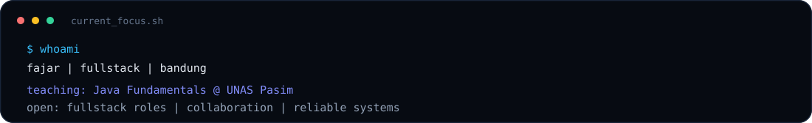
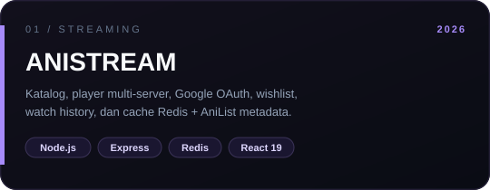
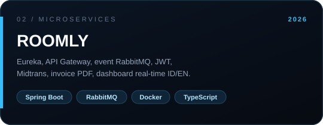
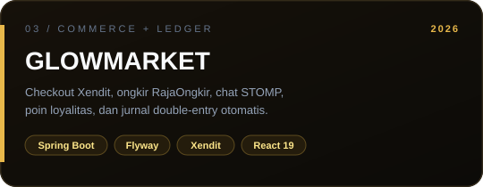
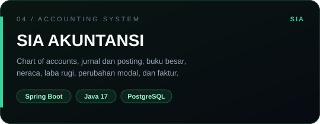

  

 

  

  
  
  

  
  
  

## Tentang saya

Saya **Fajar Rafsan**, fullstack developer di Bandung. Saya merancang sistem ujung ke ujung: API Java/Spring yang andal di belakang, interface React 19 / TypeScript yang jelas di depan.

Latar **akuntansi** (S1, IPK 3.71) membentuk cara saya merancang data — transaksi harus seimbang, migrasi harus terkunci, otorisasi tidak boleh bocor ke klien. Latar **engineering** memberi sistemnya: service layer, event, cache, dan kontrak REST yang bisa diikuti UI.

Saat ini saya mengajar **Java Fundamentals** di Universitas Nasional Pasim, dan terbuka untuk kesempatan fullstack.

### Cara saya membangun

| Batas | Prinsip |
| --- | --- |
| **Auth** | Keputusan otorisasi tetap di gateway dan service. Front end hanya membawa identitas. |
| **Kontrak** | Tipe di klien mengikuti REST, bukan sebaliknya — UI tidak menebak bentuk data. |
| **Event** | Setiap request punya jalur. Setiap event (RabbitMQ / WebSocket) punya tujuan. |
| **Data** | PostgreSQL + migrasi Flyway. Cache Redis untuk yang sering dibaca, bukan untuk yang harus benar. |

## Sistem yang saya bangun

Empat sistem nyata — streaming, reservasi hotel, e-commerce emas, dan akuntansi — bukan daftar tutorial.

<table width="100%">
  <tr>
    <td width="50%" valign="top">
      
      

        
        
      

      Dual-source: katalog/episode dari Samehadaku, metadata dari AniList GraphQL. Auth email + Google OAuth, Redis single-flight cache, Prisma, PostgreSQL.
    </td>
    <td width="50%" valign="top">
      
      

        
        
      

      Microservices event-driven: Eureka, API Gateway, RabbitMQ, JWT, pembayaran Midtrans, invoice PDF. Dashboard React 19 + TypeScript, analitik live, dwibahasa ID/EN.
    </td>
  </tr>
  <tr>
    <td width="50%" valign="top">
      
      

        
        
      

      E-commerce perhiasan emas: Xendit, RajaOngkir, chat WebSocket/STOMP, poin loyalitas, retur, dan pembukuan double-entry yang menjurnal setiap transaksi. Flyway mengunci skema.
    </td>
    <td width="50%" valign="top">
      
      

        
      

      Sistem informasi akuntansi: chart of accounts, jurnal umum & posting, buku besar, neraca saldo, laba rugi, neraca, perubahan modal, periode, dan faktur penjualan.
    </td>
  </tr>
</table>

<strong>Proyek lain</strong>

- [Gold-Price-Manager](https://github.com/fajarrafsan02-bit/Gold-Price-Manager) — pelacakan harga emas 24K/22K/18K dengan rasio karat dan riwayat perubahan.
- [Belajar-Java](https://github.com/fajarrafsan02-bit/Belajar-Java) — materi dan latihan Java yang saya pakai saat mengajar.
- [fajar-creative-portfolio](https://github.com/fajarrafsan02-bit/fajar-creative-portfolio) — situs portofolio (Cloudflare Workers).

## Stack

Alat yang benar-benar dipakai di sistem di atas — bukan daftar semua yang pernah disentuh.

**Backend & data**

  

**Frontend**

  

**Runtime & tools**

  

| Lapisan | Yang saya kerjakan |
| --- | --- |
| **Java & Spring Boot** | REST, Spring Security, JWT / OAuth2, service layer, Flyway |
| **Microservices** | Eureka, API Gateway, RabbitMQ, Docker Compose |
| **Data** | PostgreSQL, Redis, transaksi, konsistensi, caching yang disengaja |
| **Interface** | React 19, TypeScript, Tailwind v4, Vite, WebSocket/STOMP |
| **Pembayaran** | Xendit (GlowMarket), Midtrans (Roomly) |

## Pengalaman & pendidikan

| Periode | Peran | Tempat |
| --- | --- | --- |
| Jan 2026 — sekarang | **Java Fundamentals Instructor** — OOP, live coding, debugging, proyek mini terstruktur | Universitas Nasional Pasim |
| Sep 2025 — Agu 2026 | **Accounting Assistant** — kelas responsi, materi, studi kasus, evaluasi | Universitas Nasional Pasim |
| 2023 — 2026 | **S1 Akuntansi · IPK 3.71** — software engineering lewat pelatihan intensif Java Backend | Universitas Nasional Pasim |

*Accounting trained my precision. Engineering gave it a system.*

## Aktivitas GitHub

  
  

  

  

  

## Hubungi saya

Terbuka untuk kesempatan fullstack, kolaborasi produk, dan diskusi sistem ujung ke ujung.

  
  

